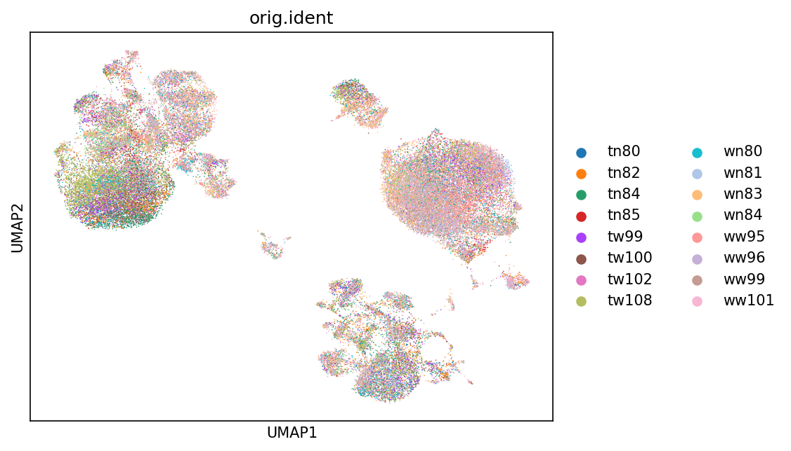
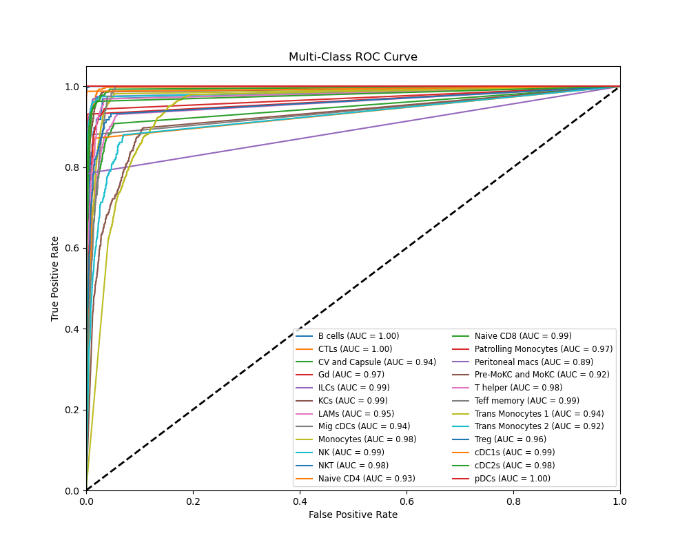
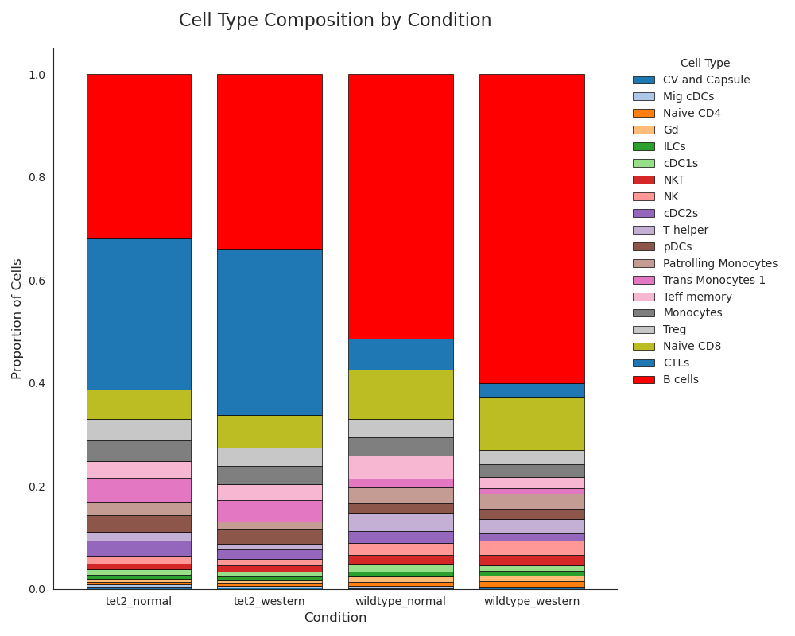
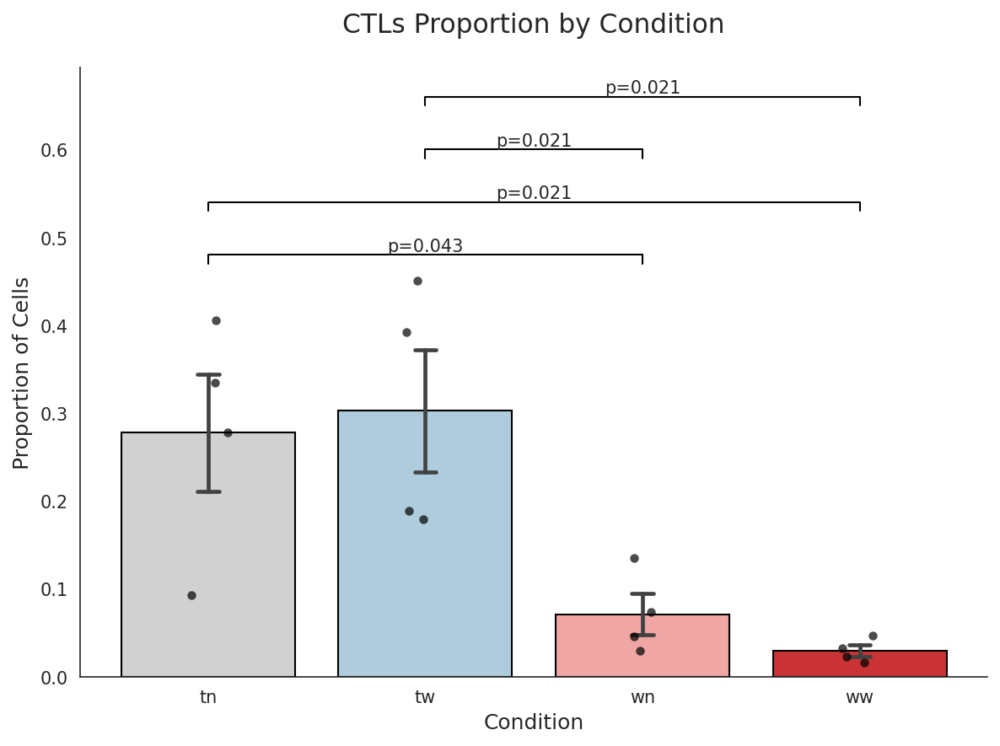
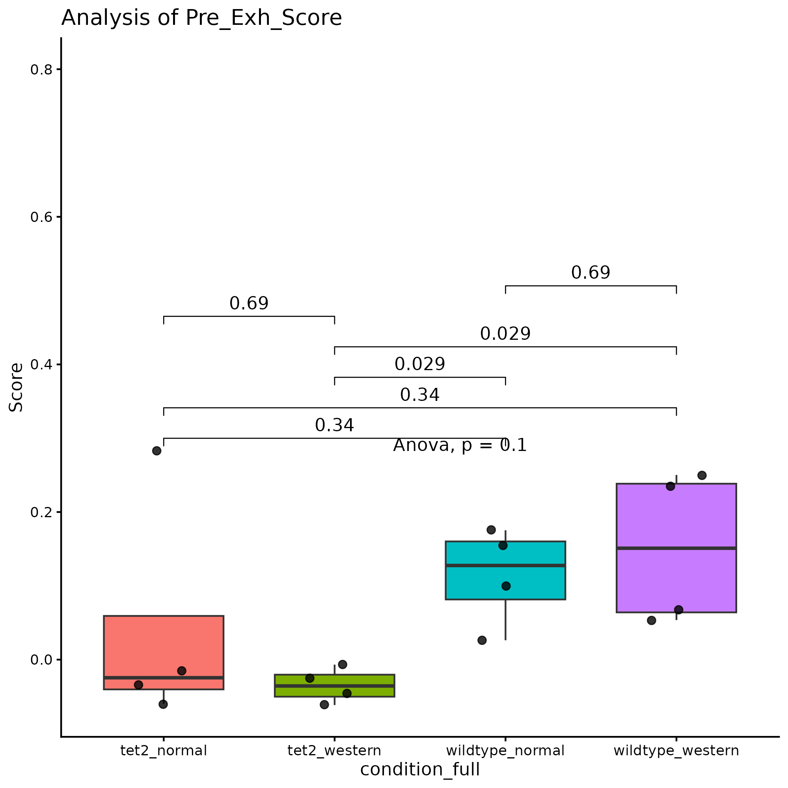
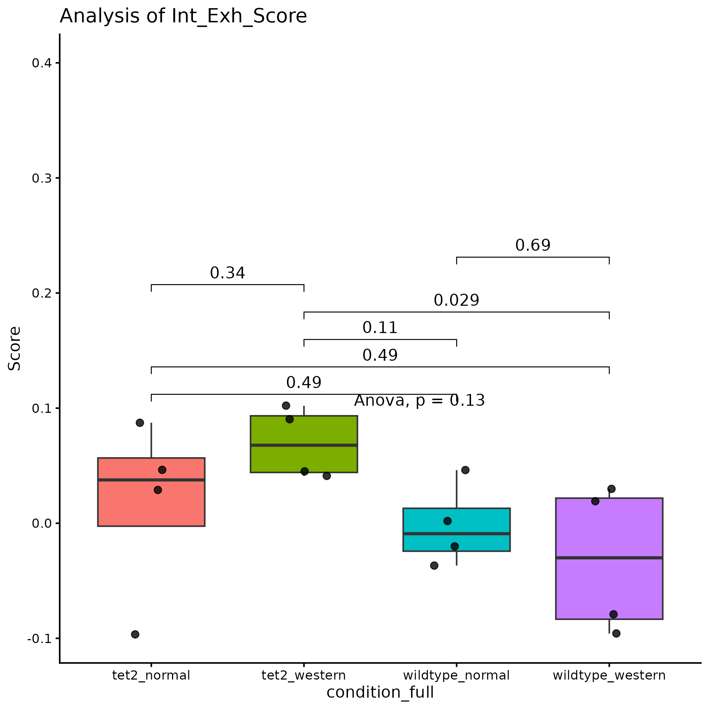
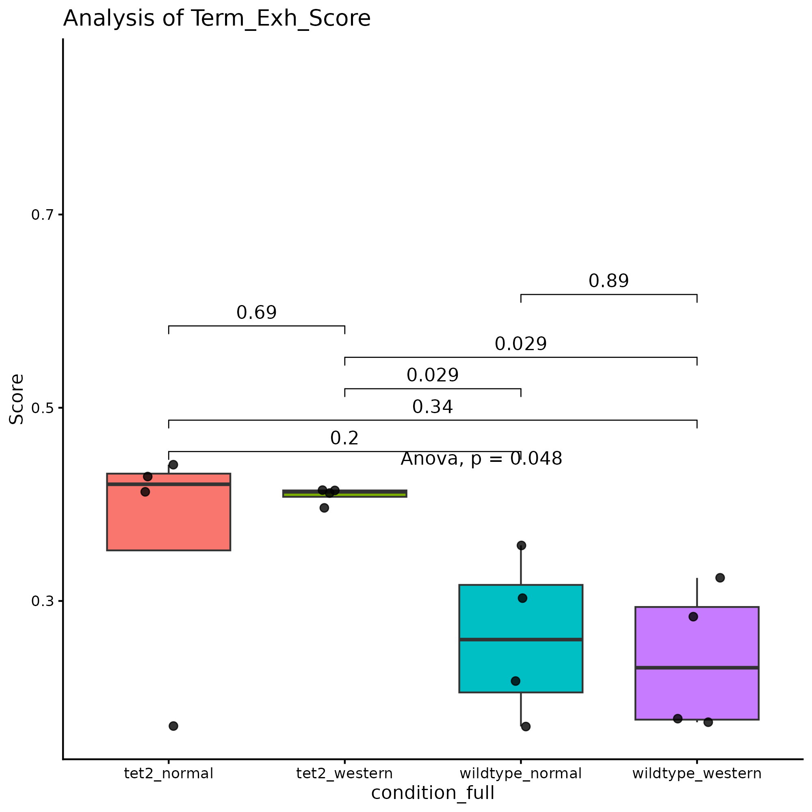
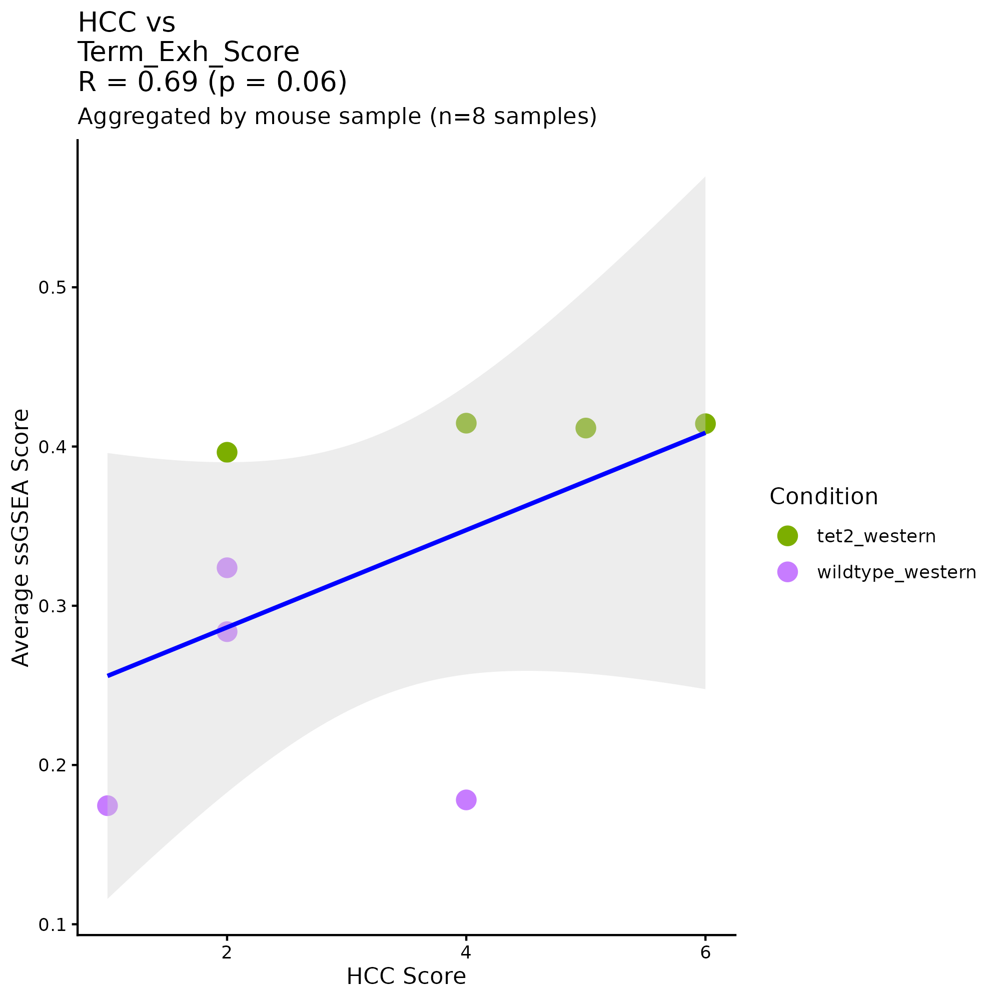

## Introduction

Clonal hematopoiesis of indeterminate potential (CHIP) is an age-related phenomenon where hematopoietic stem cells (HSCs) acquire mutations that confer a fitness advantage while leading to an increased risk of cardiovascular disorders and cancer (Verdonschot et al. 2023). This condition has several known driver mutations such as TET2, the focus of this project, and DNMT3A (Campbell et al. 2022). Recently there have been studies that investigate how CHIP and high fat diets in mice contribute to disease but more research must be done to elucidate the mechanism. In this project we focus on how CHIP in conjunction with a western diet (WD) in mice influences hepatocellular carcinoma (HCC) using single cell sequencing data. In particular we will characterize some of the cellular processes and patterns seen in CHIP related HCC. This project aims to get a better understanding of how this phenomenon occurs in mice to get actionable insights for humans. In this project we will specifically focus on some fundamental analyses including a breakdown of the different cell types in the data as well as what CD8+ T cells, a type of T cell with cytotoxic activity, is doing.

## Methods

The main data we analyze is single-cell RNA-seq data for 4 different conditions of mice: tet2 knockout (KO) mice on normal diet, tet2 KO mice on western diet, wildtype mice on normal diet, and wildtype mice on western diet. In total there are 16 mice with 4 mice for each of these conditions. Each of these mice also have scores from 0-6 to measure the degree of HCC severity as measured by a clinician collaborator. To analyze the data we first begin with preprocessing the data and preparing for clustering and cell type annotation. The preprocessing, clustering, and cell type annotation was conducted in a Jupyter notebook called "clustering_and_analysis.ipynb" in a Python environment with Scanpy, NumPy, Pandas, and several other packages. In the preprocessing steps we removed cells with fewer than 1000 unique genes and cells with more than 10% expression of mitochondrial genes. We then normalized to 10,000 counts per cell and performed a log1p transformation on counts. We then conducted PCA and computed neighbors and calculated and visualized a UMAP. We colored the UMAP by mouse sample ID to check for batch effects, of which there did not appear to be any. Following this we moved onto cell type annotation which we did using a liver single cell atlas for NAFLD mice (Guilliams et al. 2022). The goal was to build a logistic regression classifier using the transcriptomic profiles and cell type labels in this reference dataset and run it on our own data. This required first subsetting the genes in the reference to match those in our data and performing normalization and a log1p transform on the counts. An 80/20 train and test split was used and a ROC plot was generated to measure classifier performance. The model was then run on our dataset and predictions were saved in an anndata object for downstream analyses.

The first analysis conducted was to determine whether there were differences in the proportions of cell types amongst the 4 different experimental conditions. A Wilcoxon rank sum test with FDR correction was used for pairwise comparisons. The code is in a Jupyter notebook called "cell_type_proportion_analysis.ipynb".

The second analysis conducted was single sample gene set enrichment analysis (ssGSEA) to analyze the activity of CD8+ T cells. Marker genes from Masopust et al. 2025 were used to score pre-exhaustion, intermediate exhaustion, and terminal exhaustion states in CD8+ T cells. The ssGSEA function from the R package GSVA was used to compute these scores. Finally, a Spearman correlation was computed between per-sample average terminal exhaustion scores and clinical HCC severity scores to assess the relationship between CTL exhaustion and tumor severity.

## Results

Before continuing with the data analysis we first present the UMAP and ROC plot, which are key quality control and validation steps before proceeding with downstream tasks.

The UMAP after preprocessing our dataset is shown below. Overall the clusters are relatively evenly colored by different samples showing there is not a strong sample related effect driving the clustering. This gives us the confidence to continue with annotation of these clusters.

In the ROC curve below evaluating the classification performance of different cell types on the hold-out test set, we can see that the model performance across the different classes is quite accurate. For some cell types the AUC is 1.0, which could indicate possible overfitting. However, we also validated the resulting predictions against a collaborator's independent cell type annotations on a cell barcode basis and found strong agreement for CTLs, B cells, and other major cell types.

After confirming the accuracy of our cell type classification we move onto visualizing patterns in the distribution of cell types across conditions.

Here we created a stacked barplot showing the proportions of cell types for each condition. One of the most immediately striking trends is a genotype-driven difference in the proportion of CTLs and B cells between the tet2 and wildtype samples. For the sake of time we will focus on CTLs. The tet2 samples appear to have an expansion of CTLs compared to the wildtype samples. Although each of the conditions have a comparable number of total cells (10-15k per sample) we performed a statistical analysis to confirm this.

Pairwise Wilcoxon rank sum tests with FDR correction revealed statistically significant differences between the proportion of CTLs in tet2 groups compared to the wildtype groups, but not between conditions within the same genotype. This genotype-driven expansion of CTLs was a compelling reason to further characterize these cells.

One of the analyses we conducted was ssGSEA to determine whether these CTLs were undergoing exhaustion, a functional state that can arise when T cells are chronically stimulated while fighting cancer (Barsch et al. 2022).

In the plots above we used marker genes for different levels of exhaustion (pre, intermediate, and terminal) from Masopust et al. 2025 to analyze the CD8+ T cells. There is a strong and statistically significant trend showing that the CTLs in the tet2 groups have higher levels of exhaustion compared to the wildtype groups.

As an additional check to see if there was a connection to clinical HCC scores we performed a Spearman correlation between the per-sample average terminal exhaustion score and the HCC severity score.

This correlational analysis reveals a strong positive trend (R=0.69, p=0.06) between HCC severity score and terminal exhaustion score, indicating that samples with more severe HCC tend to have greater exhaustion of their CTLs.

## Discussion

Based on the cell type proportions of the 4 different conditions there appears to be a strong genotype-driven difference. In particular the proportions of CTLs and B cells appear to differ between the tet2 and wildtype groups. We focus on CTLs in particular and observe an expansion of CTLs in the tet2 groups compared to the wildtype groups, which may be due to CTLs either proliferating or migrating to the liver in order to combat effects resulting from Tet2 loss of function. This change is statistically significant. Further analysis of these CTLs from the lens of exhaustion shows that the CTLs in the tet2 groups are exhausted, consistent with prior work showing that CTL exhaustion is a hallmark of the hepatocellular carcinoma tumor microenvironment (Barsch et al. 2022). This could be due to the CTLs fighting either the HCC or some other Tet2-related effect. Additionally, the correlational analysis between HCC severity scores and terminal exhaustion scores shows a strong trend (R=0.69, p=0.06) between HCC severity and exhaustion, pointing to mice with more severe HCC having more exhausted CTLs. However this p-value is on the brink of significance and more samples may need to be generated and analyzed to confirm this finding. There are other limitations to these analyses as well, including a lack of wet lab validation, relatively small numbers of samples and replicates, and a lack of a causal mechanism. However we plan to address these limitations over time as we work with our collaborators.

## References

Barsch M, Salié H, Schlaak AE, Zhang Z, Hess M, Mayer LS, Tauber C, Otto-Mora P, Ohtani T, Nilsson T, Wischer L, Schabel E, Grimm M, Bartsch O, Bengsch B. 2022. T-cell exhaustion and residency dynamics inform clinical outcomes in hepatocellular carcinoma. J Hepatol 77: 397–409.

Guilliams M, Bonnardel J, Haest B, Vanderborght B, Wagner C, Remmerie A, Bujko A, Martens L, Thoné T, Browaeys R, De Ponti FF, Vanneste B, Zwicker C, Svedberg FR, Vanhalewyn T, Gonçalves A, Lippens S, Devriendt B, Cox E, Scott CL. 2022. Spatial proteogenomics reveals distinct and evolutionarily conserved hepatic macrophage niches. Cell 185: 379–396.

Masopust D, Soerens AG, Quarnstrom CF, Ahmed R. 2025. T cell nomenclature: from subsets to modules. Nature Reviews Immunology. doi:10.1038/s41577-025-01246-2.

Mitchell E, Spencer Chapman M, Williams N, et al. 2022. Clonal dynamics of haematopoiesis across the human lifespan. Nature 606: 343–350.

Sikking MA, Stroeks SLVM, Waring OJ, Henkens MTHM, Riksen NP, Hoischen A, Heymans SRB, Verdonschot JAJ. 2023. Clonal hematopoiesis of indeterminate potential from a heart failure specialist's point of view. J Am Heart Assoc 12: e030603.
