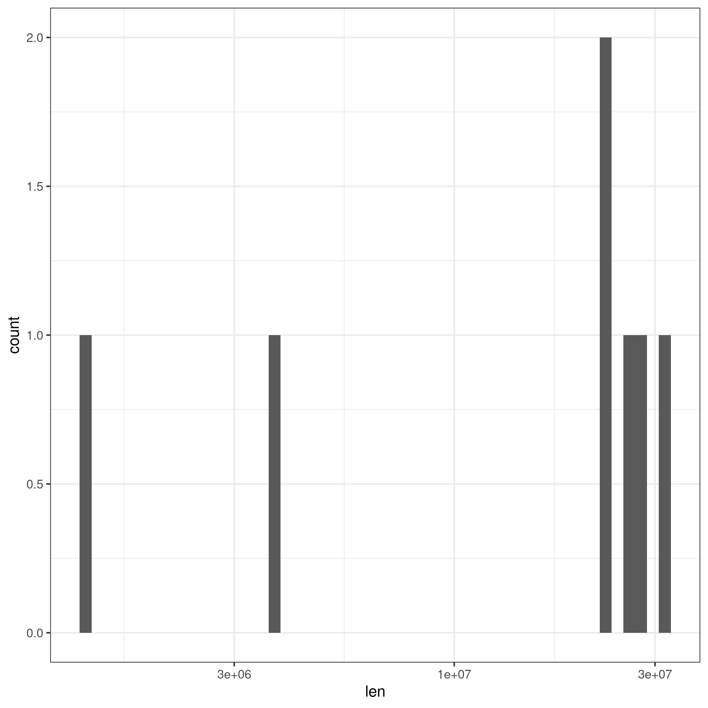
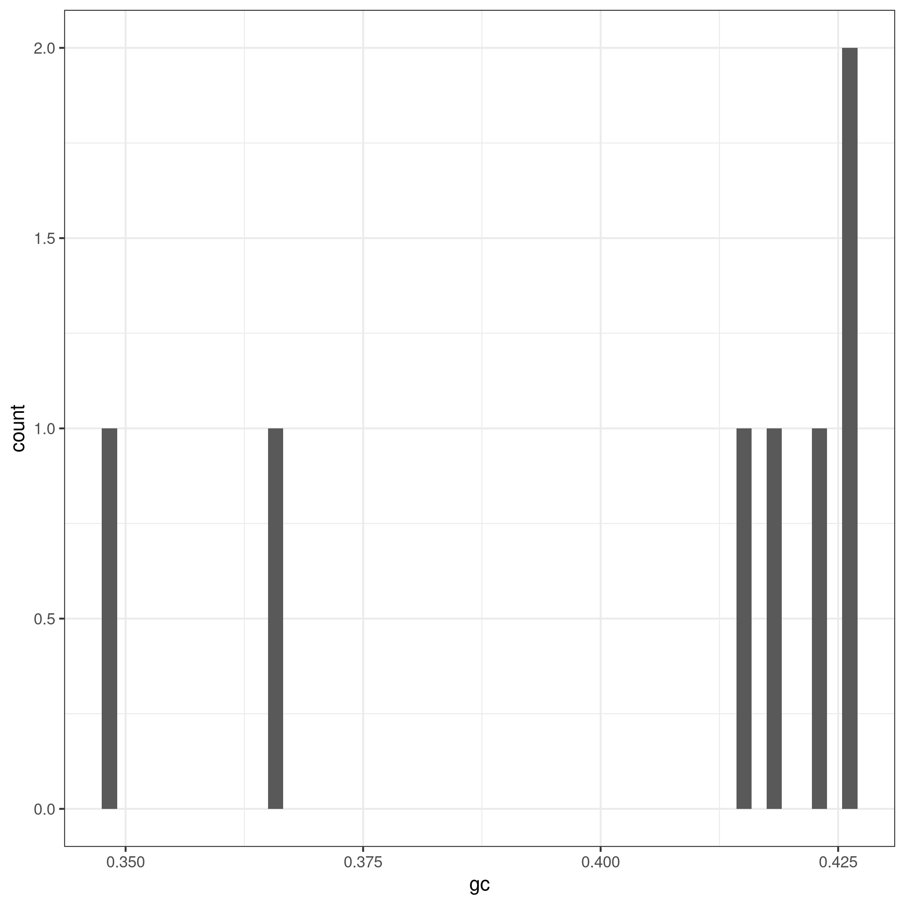
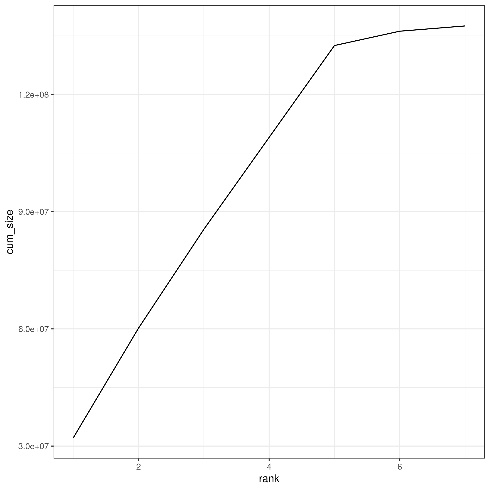
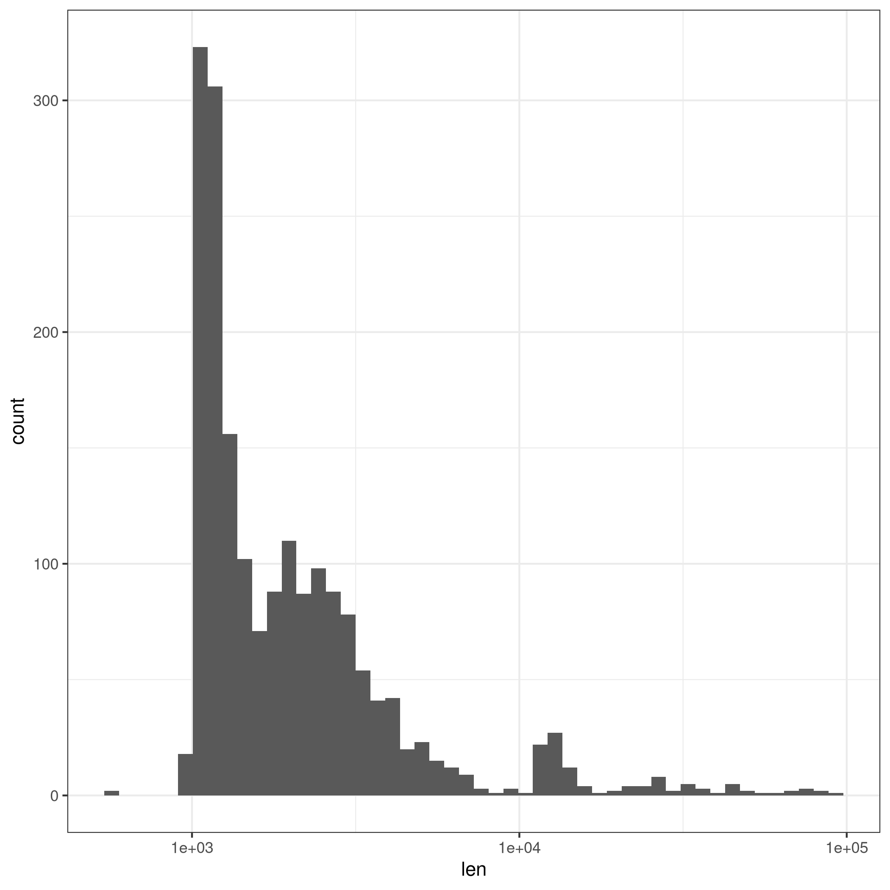
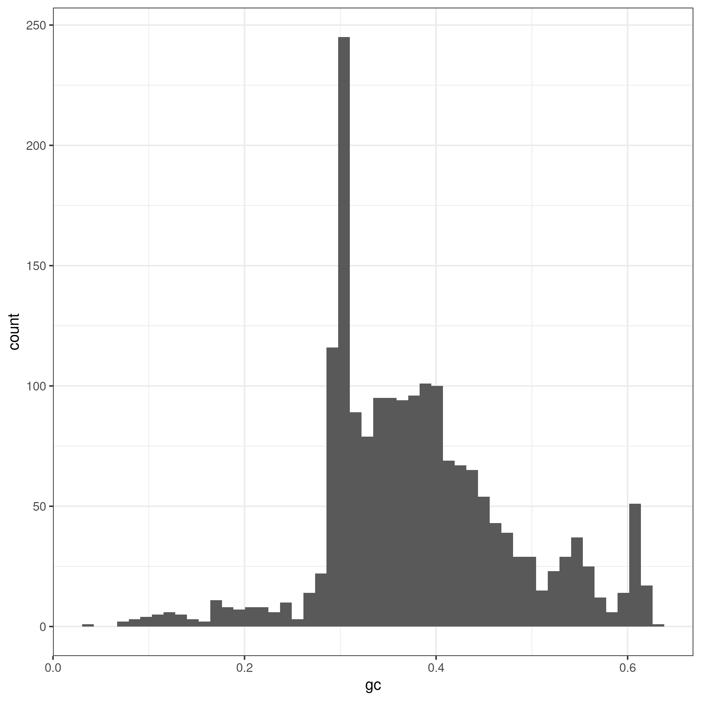
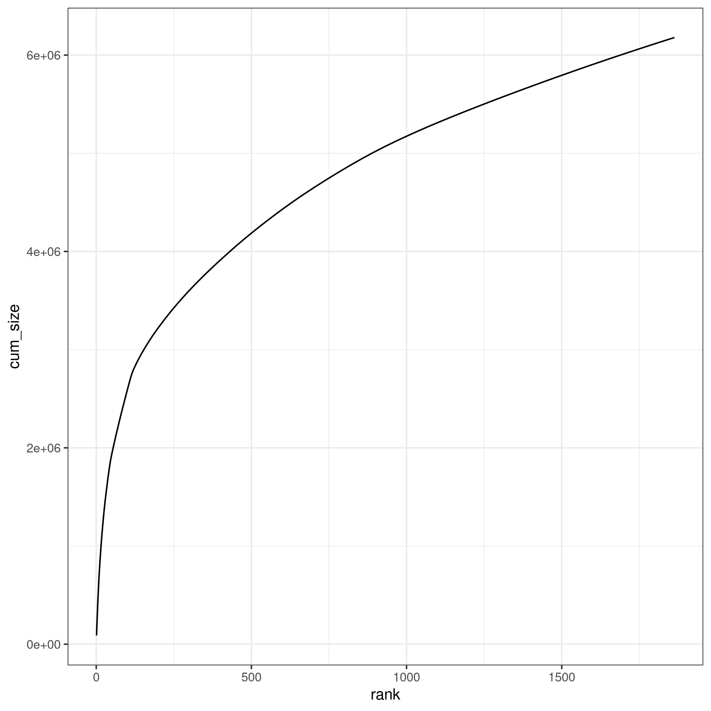
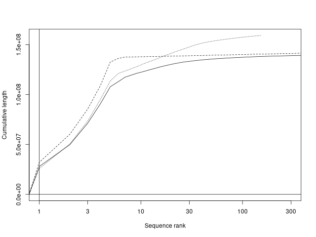

## Summarize partitions of a genome assembly

I used bioawk in the following script which I raun using the following command and obtained the results below
```
./pub/asdalvi/informatics_class/ee282_hw4/code/scripts/hw4_genome_summary.sh 
```


### Sequences > 100kb
Total number of nucleotides is 137,057,575
Total number of Ns is 490,385
Total number of sequences is 7

### Sequences <= 100kb
Total number of nucleotides 5,515,449
Total number of Ns is 662,593
Total number of sequences is 1,863

### Plots for difference metrics for sequences (> 100kb and <= 100kb)

In order to generate the plots below I ran the code below 
```
Rscript /pub/asdalvi/informatics_class/ee282_hw4/code/scripts/hw4_plots.R 
```

However this code relies on data_large.txt and data_small.txt which have summarized info from bioawk.
These txt files are generated by running the following (runs on flybase fasta)
```
./pub/asdalvi/informatics_class/ee282_hw4/code/scripts/hw4_data_prep.sh 
```

#### Plots of the following for all sequences > 100kb:




#### Plots of the following for all sequences <= 100kb:




## Genome assembly

### Assemble a genome using Pacbio HiFi reads

I assembled the genome by first copying over data from Professor Emerson's directory 
```
cp /pub/jje/ee282/ISO_HiFi_Shukla2025.fasta.gz /pub/asdalvi/informatics_class/ee282_hw4/data/raw/
```

Then I ran hifiasm to produce a gfa file
```
hifiasm -o /pub/asdalvi/informatics_class/ee282_hw4/data/raw/dmel_hifi -t 16 /pub/asdalvi/informatics_class/ee282_hw4/data/raw/ISO_HiFi_Shukla2025.fasta.gz
```

Finally I need to convert from gta to fasta
```
awk '/^S/{print ">"$2"\n"$3}' /pub/asdalvi/informatics_class/ee282_hw4/data/raw/dmel_hifi.bp.p_ctg.gfa > /pub/asdalvi/informatics_class/ee282_hw4/data/processed/dmel_hifi.fasta
```


### Assembly assessment

#### Calculate N50

We calculate N50 using the following script (same thing as class where we get lengths, sort, and get N50 contig)
```
./pub/asdalvi/informatics_class/ee282_hw4/code/scripts/hw4_n50.sh
```

The n50 value we got was 21,715,751 which is a great sign that our contigs are assembled well (long and continuous).

#### Compare Assemlby to Contig and Scaffold using Continunity Plot 

We use the following script (we use some of the scripts such as plotCDF, etc from Professor Emerson)
```
./pub/asdalvi/informatics_class/ee282_hw4/code/scripts/hw4_compare_assemblies.sh
```

The resulting plot looks this


In the plot we see that the hifi assembly (the dashed line) is much more contiguous than the flybase contig 
assembly (solid line) and almost nearly matched the scaffold level reference. This demonstrates that hifi long reads 
successfully bridged gaps present in the previous reference contigs. 

#### Busco 

I ran busco using the following command for the hifi assembly
```
busco -i /pub/asdalvi/informatics_class/ee282_hw4/data/processed/dmel_hifi.fasta \                                                                                                                                                  
      -o /pub/asdalvi/informatics_class/ee282_hw4/output/busco_results \                                                                                                                                                                                                        
      -l diptera_odb10 \                                                                                                                                                                                                                                                        
      -m genome \                                                                                                                                                                                                                                                               
      -c 16                  
```

I also ran busco on the flybase ref using this command:
```
busco -i /pub/asdalvi/informatics_class/ee282_hw4/data/raw/dmel-all-chromosome-r6.66.fasta.gz \
      -o /pub/asdalvi/informatics_class/ee282_hw4/output/busco_fb_ref \
      -l diptera_odb10 \
      -m genome \
      -c 16
```

The outputs from running busco on the hifi was C:99.8%[S:99.6%,D:0.2%],F:0.0%,M:0.2%,n:3285,E:10.6% and
the output from running on flybase was C:99.9%[S:99.7%,D:0.3%],F:0.0%,M:0.1%,n:3285,E:10.6%
As you can see the complete scores are 99.8% and 99.9% respectively. The results are very close
so in essence we recreated a genome similar to the reference which is interesting. The hifi had 5 missing buscos and flybase had 2. 
